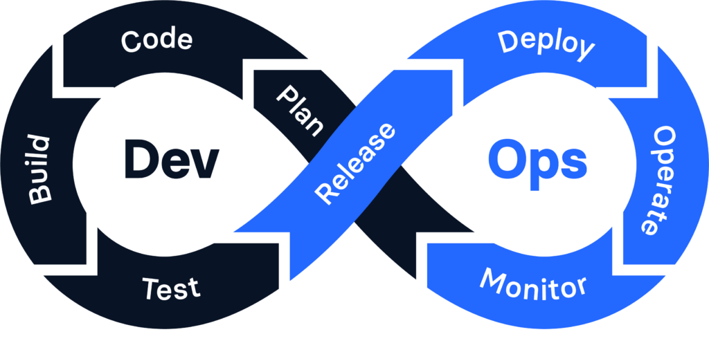

# Repositorio DevOps
1. [Inicio](README.md)
2. [Herramientas](Herramientas.md)
3. [Ideas](Ideas.md)
# Filosofia DevOps.

  
  
##### DevOps busca potenciar los recursos de empresas, permitiendo el desempeño de funciones con mucha mas eficiencia, ahorrando tiempo y recursos.

Principios de la filosofía DevOps
##### ***Colaboración y Comunicación:***
Fomenta la colaboración constante entre los equipos de desarrollo, operaciones y otros involucrados (como seguridad o calidad). La comunicación es clave para evitar malentendidos y mejorar el flujo de trabajo.
##### ***Integración Continua y Entrega Continua (CI/CD):***

DevOps busca que el software se integre y se despliegue de manera continua en entornos de producción, permitiendo que los cambios sean pequeños y frecuentes en lugar de grandes actualizaciones. Esto reduce los riesgos y permite una respuesta rápida a errores o mejoras.
##### ***Automatización:***

Todo lo que pueda automatizarse debe ser automatizado. Esto incluye tareas de pruebas, despliegues, monitoreo y aprovisionamiento de infraestructura. La automatización no solo ahorra tiempo, sino que también reduce errores humanos y permite que los equipos se concentren en tareas de mayor valor.
##### ***Cultura de Responsabilidad Compartida:***

En lugar de que cada equipo trabaje en una etapa aislada, todos asumen la responsabilidad de la calidad y estabilidad del producto en producción. Esto promueve una visión conjunta y evita que el éxito de un área se logre a costa de otra.
##### ***Mejora Continua:***

DevOps adopta una mentalidad de crecimiento constante, buscando siempre mejorar procesos, herramientas y habilidades. Los equipos realizan retrospectivas y análisis de los errores para aprender y evitar problemas en el futuro.
##### ***Monitoreo y Retroalimentación Continua:***

El monitoreo de los sistemas y la recopilación de datos en tiempo real es fundamental en DevOps. Esto permite obtener retroalimentación rápida sobre el rendimiento de los servicios en producción y hacer ajustes proactivos o reactivos.
>
# Conclusion
> [!NOTE]
> La cultura DevOps prueme la colaboracion, el ahorro de recurso y por tanto la utilizacion de estos de manera eficiente.
