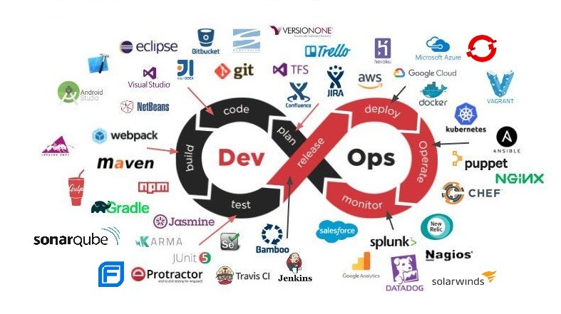

# Herramientas Devops
  
#
### ***Sobre DevOps***
1. [Inicio](README.md)
2. [Filosofia](Filosofia.md)
3. [Empleo](Oferta_Empleo.md)
#
> [!NOTE]
> Cuando tenemos que recurrir a DevOps se nos presentas multiples herramientas que podemos usar dependiendo del trabajo que tengamos que realizar.

| Objetivo                |Aplicacion|
| -----------------------------|-----------------------------|
|   Planificación:   | Jira: Gestión de proyectos que organiza tareas y facilita la colaboración en equipos.|
| Gestión de Código :| Git: Sistema de control de versiones que permite a los desarrolladores gestionar y rastrear cambios en el código.|
| Automatización de pruebas :| Selenium: Automatiza pruebas de aplicaciones web simulando interacciones del usuario.|
| Integración y entrega continua: |Jenkins: Herramienta de automatización que facilita la integración y entrega continua mediante la configuración de pipelines.|
| Gestión de configuración:| Ansible: Automatiza la gestión de configuración y aprovisionamiento de servidores.|
|Monitorización: |-Prometheus: Sistema de monitorización que recopila métricas en tiempo real. |
| Contenedores y orquestación: |  Docker:Plataforma que permite crear y ejecutar aplicaciones en contenedores portátiles.|
