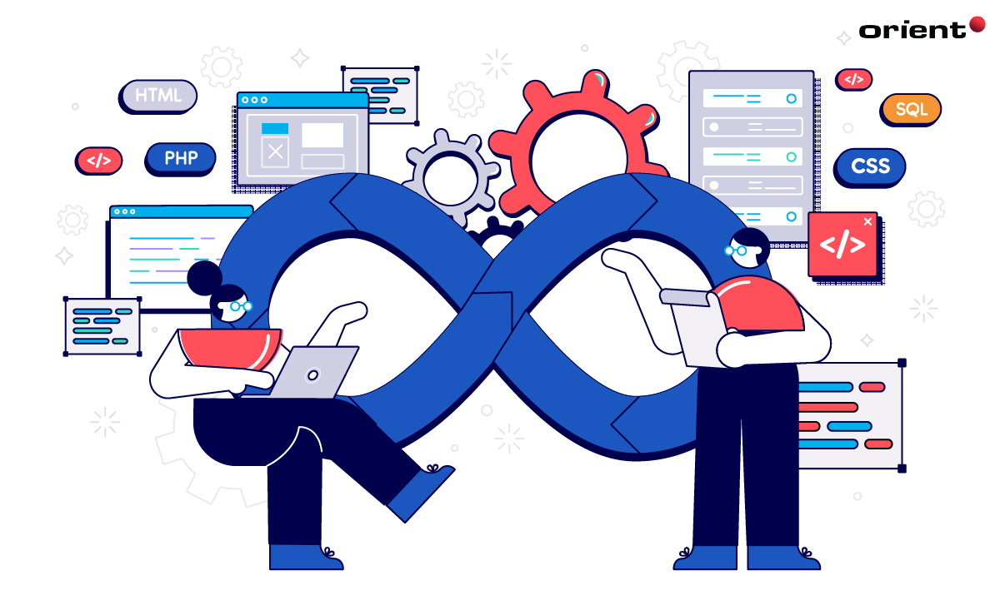

# DevOps

## ¿Que es DevOps?.

DevOps es una filosofía que mejora la colaboración entre los equipos de desarrollo y
operaciones, enfocándose en la integración y automatización de procesos a lo largo
del ciclo de vida del software. Incluye prácticas como la Integración Continua (CI),
que permite detectar errores tempranamente; la Entrega Continua (CD), que
automatiza el despliegue de aplicaciones para lanzamientos más frecuentes; la
Infraestructura como Código (IaC), que gestiona la infraestructura mediante código,
garantizando consistencia y escalabilidad; y la monitorización y logging, que
proporcionan visibilidad sobre el rendimiento y permiten la detección proactiva de
problemas. Además, fomenta una cultura colaborativa donde todos los miembros
son responsables del éxito del software, promoviendo la comunicación abierta y la
mejora continua.

# Objetivos de Devops.
  1º Ciclos de desarrollo más cortos que favorecen la innovación.  
  2º Mayor colaboración, mayor comunicación  
  3º Menores tasas de errores de implementación y acelerar tiempos de recuperación  
  4º Eficiencia: Mejor gestión de los recursos  

## Sobre DevOps.
1. [Filosofia](Filosofia.md)
2. [Herramientas](Herramientas.md)
3. [Ideas](Ideas.md)

